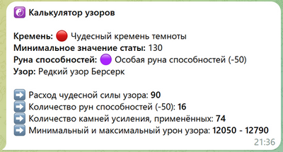
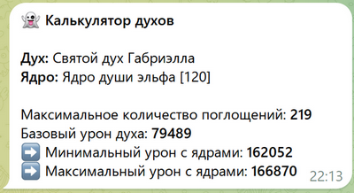
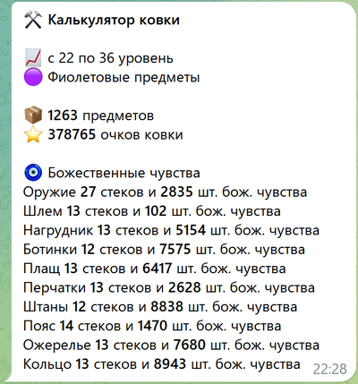

# Telegram BS Game Bot

Telegram-бот с калькуляторами для игры Blood and Soul.

> ⚠️ На момент деплоя калькуляторы актуальны для серверов GameNet.

---

## 🤖 Попробовать бота

Бот доступен в Telegram: [Открыть бота](https://t.me/bs_game_bot)

> ⚠️ Бот может иметь ограничения или быть недоступен в любое время

---

## 📸 Примеры работы

#### ☯️ Результат расчёта узоров


#### 👻 Результат расчёта духов


#### ⚒️ Результат расчёта ковки


---

## 📦 Установка и настройка

### 1. Клонировать репозиторий

```bash
git clone https://github.com/tea-eagle/bs-game-bot.git
cd bs-game-bot
```

### 2. Создать конфигурацию

```bash
cp config/example-main.yaml config/main.yaml
```

Отредактировать файл `config/main.yaml`:

> ⚠️ При использовании в качестве кеша Redis блок databases не нужен  
> ⚠️ defined_forum_themes нужен только для группы с топиками, чтобы бот отвечал в конкретный топик  

Пояснения:
- bot_token — токен Telegram-бота
- chat — ID группы
- room — ID темы (topic/thread в Telegram форумах)
- databases.mysql — настройки подключения к БД

### 3. Настроить базу данных

```sql
CREATE TABLE IF NOT EXISTS `bs_tg_bot` (
  `id` int NOT NULL AUTO_INCREMENT,
  `user` varchar(50) NOT NULL,
  `json` json DEFAULT NULL,
  `active` tinyint(1) DEFAULT '1',
  `created_at` datetime NOT NULL DEFAULT CURRENT_TIMESTAMP,
  `updated_at` datetime NOT NULL DEFAULT CURRENT_TIMESTAMP ON UPDATE CURRENT_TIMESTAMP,
  PRIMARY KEY (`id`),
  UNIQUE KEY `user` (`user`)
) ENGINE=InnoDB DEFAULT CHARSET=utf8mb4;
```

### 4. Настроить webhook

```bash
https://api.telegram.org/bot<TOKEN>/setWebhook?url=https://YOUR_DOMAIN/YOUR_PROJECT_DIRECTORY/
```
Замените:
> YOUR_DOMAIN — на ваш домен  
> YOUR_PROJECT_DIRECTORY — на директорию, где размещён проект (если не в корне сайта)  

---

## 🧪 Отладка

Если бот не отвечает:

- Проверить установлен ли webhook
- Проверить HTTPS (Telegram не работает с HTTP)
- Проверить логи сервера
- Убедиться, что токен указан правильно

---

## 📄 License

MIT
